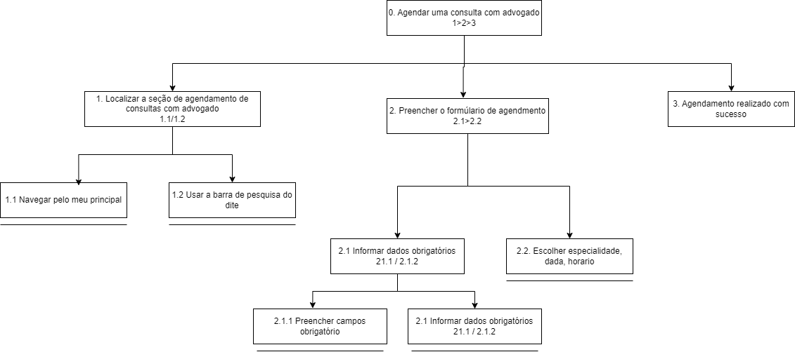

|    Data    | Data Prevista de Revisão | Versão |           Descrição            |                                                                                 Autor                                                                                 |                     Revisor                      |
| :--------: | :----------------------: | :----: | :----------------------------: | :-------------------------------------------------------------------------------------------------------------------------------------------------------------------: | :----------------------------------------------: |
| 01/12/2024 |        02/12/2024        |  1.0   |      Criação do Documento      | [João Victor C. Nobre](https://github.com/Gam13)   [Karolina Vieira](https://github.com/Karolina91)  [Paola Nascimento](https://github.com/paolaalim) |   [Lucas Sales](https://github.com/Lux-Sales)    |
| 02/12/2024 |        02/12/2024        |  1.1   | Adição do histórico de versões |                                                              [Lucas Sales](https://github.com/Lux-Sales)                                                              | [João Victor C. Nobre](https://github.com/Gam13) |
| 02/12/2024 |        02/12/2024        |  1.2   |      Adição da tarefa 04       |                                                              [Lucas Sales](https://github.com/Lux-Sales)     
| 28/12/2024 |        03/01/2025        |  1.3   | Modificação Tarefa 01 |                                                              [Karolina Vieira](https://github.com/Karolina91)                                                              | [Paola Nascimento](https://github.com/paolaalim) |
| 03/01/2025 |        03/01/2025        |  1.4   |      Adição da tarefa 05       |                                                              [Paola Nascimento](https://github.com/paolaalim)                                                         | [Karolina Vieira](https://github.com/Karolina91) |
| 20/01/2025 |        20/01/2025        |  1.5   |      Atualização da tarefa 02       |                                                              [Paola Nascimento](https://github.com/paolaalim)                                                         | [Karolina Vieira](https://github.com/Karolina91) |

# **Análise de Tarefas para o Site da Defensoria Pública do Distrito Federal (DPDF)**

## **Objetivos, Operadores, Métodos e Regras de Seleção (GOMS)**

A metodologia GOMS (Goals, Operators, Methods, and Selection Rules) é usada para detalhar as ações necessárias para concluir tarefas no site da DPDF. Abaixo, apresentamos a análise de tarefas realizadas no site:

---

## **Tarefa 1: Agendar uma consulta com advogado (funcionalidade inexistente no site)**

**GOAL 0:** Agendar consulta com Advogado

**GOAL 1:** Localizar a seção de agendamento.

**METHOD 1.A:** Navegar pelo menu principal.

- OP. 1.A.1: Ler as opções do menu principal.
- OP. 1.A.2: Clicar na seção "Agendar consulta com advogado".

**METHOD 1.B**: Usar a barra de pesquisa do site.
- OP. 1.B.1: Localizar a barra de pesquisa no site..
- OP. 1.B.3: Digitar "agendamento de consulta com advogado".
- OP. 1.B.4: Pressionar "Enter".
- OP. 1.B.6: Clicar no link correspondente.

**GOAL** 2: Preencher o formulário de agendamento.

**METHOD** 2.A: Informar dados obrigatórios.

**METHOD** 2.A.A:Preencher campos obrigatórios.

- OP. 2.A.A.1:Preencher nome, CPF, endereço 

**METHOD** 2.B: Escolher especialidade, data, horário.
- OP. 2.B.1: Escolher especialidade que deseja atendimento no menu suspenso.
- OP. 2.B.2: Selecionar a data desejada no calendário interativo.
- OP. 2.B.3: Escolher o horário disponível na lista de opções.

**GOAL 3**: Concluir o agendamento.

**METHOD 3.A**: Salvar o comprovante de agendamento.
- OP. 3.A.1: Clicar no botão "Baixar comprovante".
- OP. 3.A.2: Escolher o local para salvar o arquivo.
- OP. 3.A.3: Confirmar o download.

Autor:[ Karolina Vieira](https://github.com/Karolina91)

## **Diagrama HTA – Agendar uma consulta com advogado**

Autor:[ Karolina Vieira](https://github.com/Karolina91)

## **Tarefa 2: Inscrever-se no Programa de Estágio da DPDF**

**Goal 0:** Buscar informações sobre o Programa de Estágio da DPDF e concluir a inscrição 

**Method 1:** Navegar no site da DPDF para encontrar informações e realizar a inscrição 

**Goal 1: Realizar a inscrição no estágio** 
- **Operator 1.1:** Preencher os dados pessoais no formulário online 
- **Operator 1.2:** Anexar documentação necessária 
- **Operator 1.3:** Clicar no botão "Enviar Inscrição" 

**Goal 2: Acompanhar a inscrição**
- **Operator 2.1:** Inserir os dados de acesso (CPF e senha).
- **Operator 2.2:** Visualizar o status da inscrição.

**Goal 3: Agendar entrevista de estágio** (se aplicável)
- **Operator 3.1:** Preencher formulário.
- **Operator 3.2:** Escolher a data e horário disponíveis.
- **Operator 3.3:** Confirmar o agendamento.
- **Operator 3.4:** Baixar comprovante

Autor:[ Poala Nascimento](https://github.com/paolaalim)
---

## **Diagrama HTA – Inscrever-se no Programa de Estágio da DPDF**

Autor:[ Poala Nascimento](https://github.com/paolaalim)

---

## **Tarefa 3: Adquirir e Preencher o Formulário para Voluntariado**

 **Goal 0:** Participar como voluntário na DPDF 

 **Method 1:** Adquirir e preencher o formulário de voluntariado 

 **Goal 1:** Acessar o site 
- **OP 1.1:** Verificar a conexão de internet. 
- **OP 1.2:** Acessar a página principal da DPDF. 

 **Goal 2:** Acessar a área correspondente para voluntariado 
- **OP 2.1:** Navegar até a aba de "Estágios ou Colaboradores". 
- **OP 2.2:** Selecionar "Serviços Voluntários Não Remunerados". 

 **Goal 3:** Consultar os requisitos para o processo 
- **OP 3.1:** Ler os documentos necessários. 
- **OP 3.2:** Recolher os documentos. 

 **Goal 4:** Contatar o gerente de voluntariado 
- **OP 4.1:** Localizar os contatos do gerente na página. 
- **OP 4.2:** Solicitar informações e orientações. 

 **Goal 5:** Preencher os formulários 
 **Method 1:** Assinatura Digital 
- **OP 5.1.1:** Acessar e preencher os formulários online. 
- **OP 5.1.2:** Assinar digitalmente. 

 **Method 2:** Assinatura Física 
- **OP 5.2.1:** Imprimir os formulários. 
- **OP 5.2.2:** Assinar fisicamente. 

**Goal 6:** Concluir o envio 
- **OP 6.1:** Submeter os documentos preenchidos. 
- **OP 6.2:** Aguardar a resposta. 

---
## **Diagrama HTA – Adquirir e Preencher Formulário para Voluntariado**

## Tarefa 4: Solicitar atendimento à SUAP 

**Goal 0: Solicitar atendimento à SUAP**
**Method 1:** Solicitar atendimento via internet

**OP 1.1** Acessar o site da defensoria pública  
**OP 1.2** Deslocar mouse até a aba “Serviços”  
**OP 1.3** Dentro de Serviços, clicar em “Atividade Psicossocial (SUAP)”  
**OP 1.4** Rolar a página para baixo, até a seção “Solicite Atendimento  aqui”  
**OP 1.5** Clicar em “AQUI” no texto “Acesse AQUI”  
**OP 1.6** Preencher formulário e clicar em próximo até chegar a uma  página de revisão dos dados 
**OP 1.7** Após finalizar a revisão dos dados, clicar no botão verde  escrito “ENVIAR FORMULÁRIO” 

## **Diagrama HTA – Solicitar atendimento à SUAP**

---
## **Tarefa 5: Utilizar o Chatbot para Assistência**

 **Goal 0:** Utilizar o chatbot para assistência 

 **Method 1:** Interagir com o chatbot para obter assistência 

 **Goal 1:** Iniciar a interação com o chatbot 
- **OP 1.1:** Deslocar o cursor até o ícone do chatbot. 
- **OP 1.2:** Clicar no ícone para abrir a janela de chat. 

 **Goal 2:** Escolher a opção desejada entre as alternativas apresentadas 
- **OP 2.1:** Clicar em uma das opções apresentadas pelo chatbot. 

 **Goal 3:** Navegar pelo chatbot 
- **OP 3.1:** Clicar no botão "Voltar" para retornar ao menu anterior. 
- **OP 3.2:** Clicar no botão "Menu Principal" para voltar às opções iniciais. 

 **Goal 4:** Obter a resposta final 
- **OP 4.1:** Ler as instruções fornecidas ou clicar no link redirecionado. 

---
## **Diagrama HTA – Utilizar o Chatbot**

---

## Bibliografia 

[1] BARBOSA, S. et al. Interação Humano-Computador e Experiência do Usuário. [s.l.] Autopublicação - Leanpub, 2021.  
