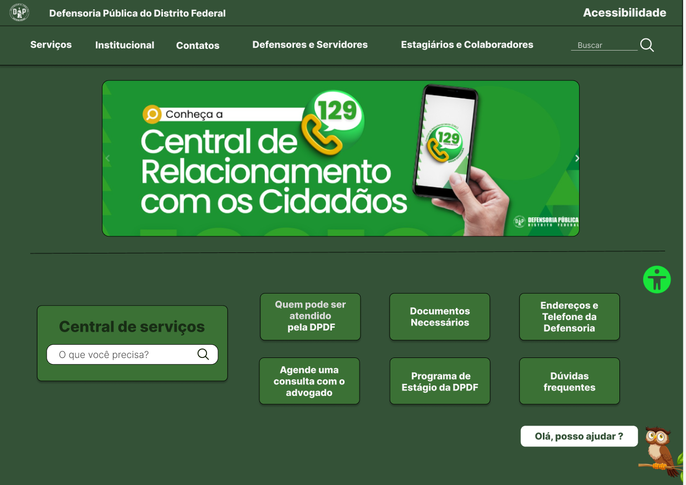
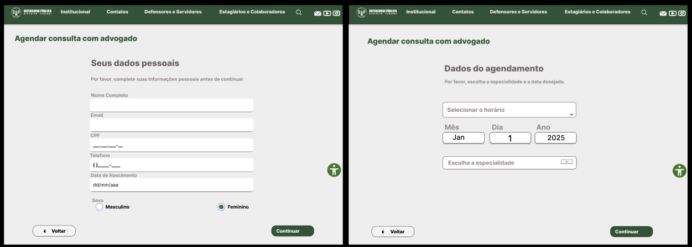
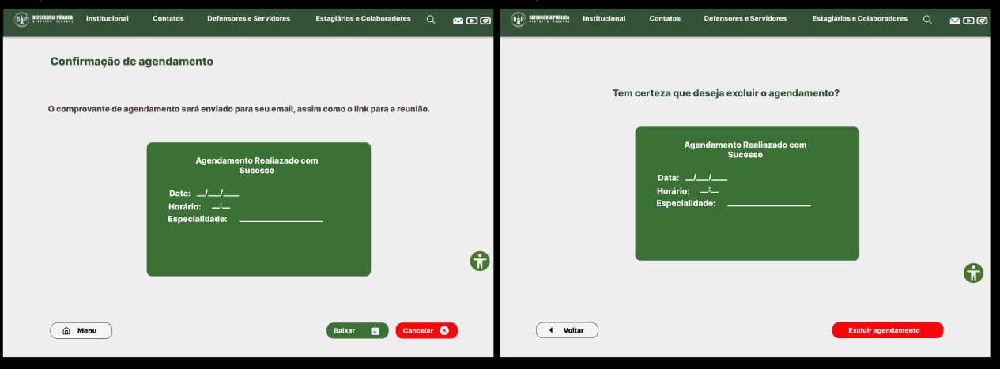
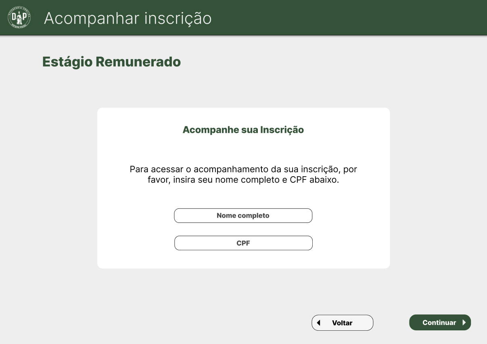
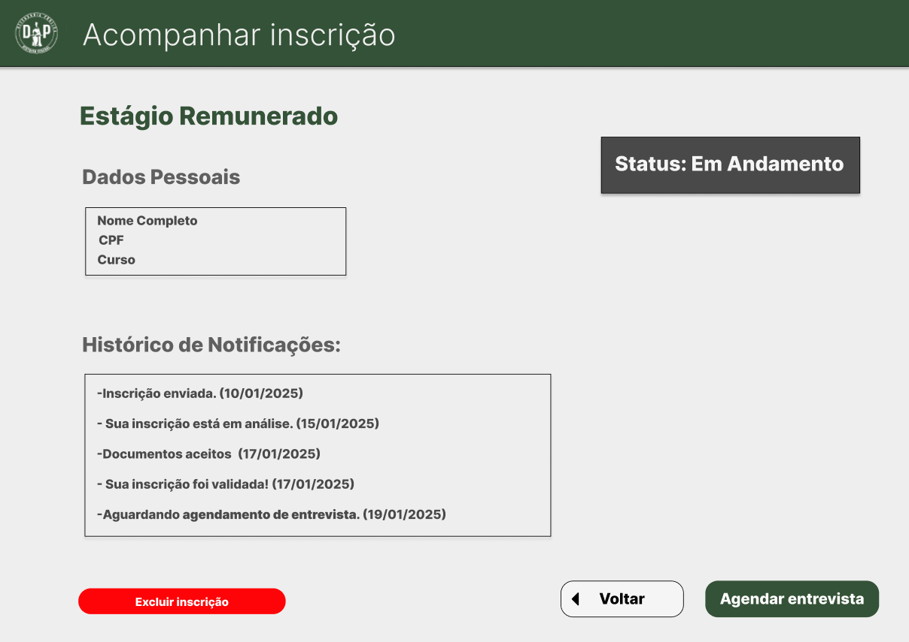
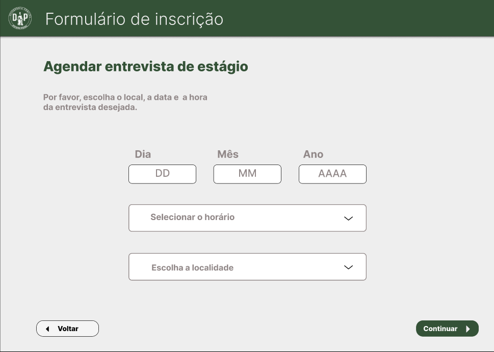
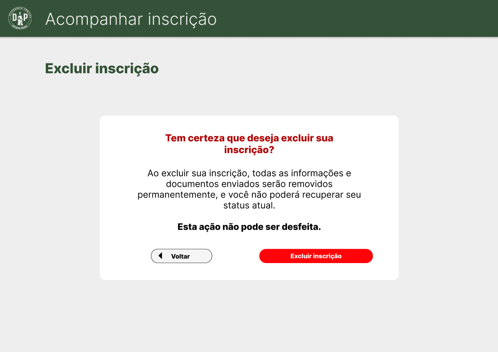
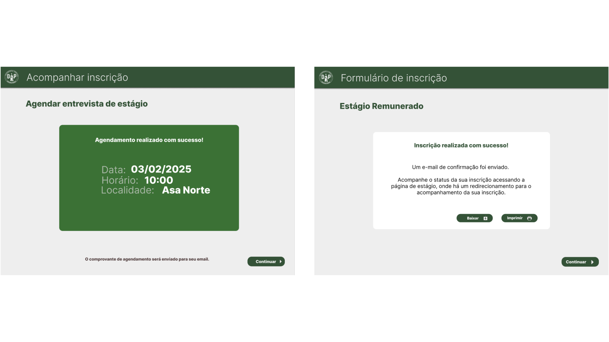

|    **Data**    | **Data Prevista de Revisão** | **Versão** |        **Descrição**        |                 **Autor**                 |                **Revisor**                 |
|:--------------:|:---------------------------:|:----------:|:---------------------------:|:-----------------------------------------:|:------------------------------------------:|
|  18/01/2025   |       18/01/2025 |  1.0     |     Criação do Documento     | [Karolina Vieira](https://github.com/Karolina91) |  [Paola Nascimento](https://github.com/paolaalim) |

# Protótipos de Alta Fidelidade

## Introdução
O protótipo de alta fidelidade é uma representação avançada do sistema proposto, que simula com precisão tanto a aparência quanto a funcionalidade do produto final. Ao contrário dos protótipos de baixa fidelidade, que se concentram em conceitos iniciais e validação de ideias básicas, o protótipo de alta fidelidade permite avaliar aspectos mais complexos, como navegabilidade, desempenho e interação do usuário com a interface. Essa abordagem busca proporcionar uma experiência mais realista ao usuário, contribuindo para a identificação de melhorias potenciais e garantindo maior alinhamento com os objetivos do projeto. Embora envolva um maior investimento de tempo e recursos, o uso de protótipos de alta fidelidade é essencial para validar decisões de design e aperfeiçoar o sistema antes de sua implementação final.

## Objetivo
Com base no nível 3 do processo de Design, Avaliação e Desenvolvimento da Engenharia de Usabilidade de Mayhew, este documento visa apresentar os protótipos de alta fidelidade desenvolvidos para as tarefas selecionadas no site da **Defensoria Pública do Distrito Federal**. A construção dos protótipos foi focada na simulação detalhada das interfaces e interações propostas, permitindo a avaliação da usabilidade, navegabilidade e aderência às necessidades dos usuários.

## Metodologia
O desenvolvimento do protótipo de alta fidelidade seguiu um processo iterativo, que teve início com a criação de protótipos de baixa fidelidade em papel. Estes serviram para definir a estrutura das interfaces e guiar o refinamento das interações.

Além disso, o **Guia de Estilo**, previamente elaborado, foi seguido durante o desenvolvimento dos protótipos de alta fidelidade, garantindo que as interfaces mantivessem consistência visual, acessibilidade e alinhamento com as necessidades do público-alvo.

## Protótipos de Alta Fidelidade
Os protótipos de alta fidelidade representam as principais funcionalidades do sistema, sendo cada uma delas desenvolvida por um integrante da equipe. A tela inicial, comum a todas as funcionalidades, foi projetada para oferecer uma navegação clara e acessível, servindo como ponto de entrada para opções como agendamento de consultas com advogado e increve-se em um programa de estágio. 

### Figura 1 -Proposta da Tela Incial da Defensoria Publica Distrito Federal 

<figcaption>Autor: Karolina Vieira (2025)</figcaption>

A seguir, são detalhados os protótipos de alta fidelidade desenvolvidos para cada funcionalidade:

## Protótipo de Alta Fidelidade 1 - Agendar uma consulta com advogado

Esta funcionalidade foi projetada para facilitar o acesso dos cidadãos ao agendamento de consultas online com advogados no site da DPDF, promovendo praticidade e eficiência na interação com o serviço público.

### Figura 2-Tela Principal do agendamento com advogado

<figcaption>Autor: Karolina Vieira (2025)</figcaption>

### Figura 3 -Definir agendamento
<figcaption>Autor: Karolina Vieira (2025)</figcaption>

### Agendamento Excuído
<figcaption>Autor: Karolina Vieira (2025)</figcaption>

## Protótipo de Alta Fidelidade 2 - Increve-se no Programa de Estágio DPDF

As figuras apresentadas a seguir ilustram o protótipo desenvolvido para a tarefa  de se inscrever no estágio da DPDF (funcionalidade criada para o projeto) com foco em um sistema que visa facilitar o processo de inscrição e acompanhamento. Cada imagem representa telas específicas projetadas para atender diferentes funcionalidades do sistema.

### Figura 4 -Tela de Estágio Remunerado
<figcaption>Autor: Paola Nascimento (2025)</figcaption>

Essa tela (Figura 4) é a página inicial desse processo, onde usuários interessados em estágios remunerados podem visualizar informações relevantes, se inscrever e acompanhar a inscrição.

### Figura 5 -Formulário de inscrição
<figcaption>Autor: Paola Nascimento (2025)</figcaption>

O formulário de inscrição (Figura 5) possibilita ao usuário cadastrar-se em um estágio de maneira prática e objetiva. Nele, os campos são organizados de forma clara, garantindo que as informações necessárias sejam preenchidas com precisão e eficiência.

### Figura 6 -Tela de login para a sessão Acompanhar inscrição
<figcaption>Autor: Paola Nascimento (2025)</figcaption>

A tela de login (Figura 6) foi projetada para garantir a segurança e personalização do acesso ao sistema. Aqui, o usuário pode autenticar-se para acompanhar o progresso de sua inscrição.  Aqui, o login é realizado com nome e CPF.
### Figura 7 -Tela de acompanhar inscrição
<figcaption>Autor: Paola Nascimento (2025)</figcaption>

A Figura 7 exibe a interface que permite aos usuários verificarem o status de suas inscrições, o histórico de notificações e agendarem entrevistas quando disponíveis. A visualização detalhada oferece maior transparência e promove a interação entre o candidato e o sistema.

### Figura 8 -Tela para agendar entrevista
<figcaption>Autor: Paola Nascimento (2025)</figcaption>

A tela para agendamento de entrevistas (Figura 8) facilita a escolha de datas, local e localidade da entrevista, proporcionando um processo eficiente e prático.

### Figura 9 -Tela para excluir inscrição
<figcaption>Autor: Paola Nascimento (2025)</figcaption>

A Figura 9 ilustra a tela destinada à exclusão de inscrições. Essa funcionalidade possibilita que o canditato gerencie suas informações.

### Figura 10 -Mensagens de erro 
<figcaption>Autor: Paola Nascimento (2025)</figcaption>

### Figura 10 -Mensagens de êxito
<figcaption>Autor: Paola Nascimento (2025)</figcaption>

Por fim, as Figuras 10 e 11 reúnem exemplos de mensagens de feedback exibidas pelo sistema, de erro e de sucesso, que contribuem para uma interação transparente e direta entre o usuário e o sistema. Essas representações visuais exemplificam o compromisso com a usabilidade e acessibilidade. 

## Referências Bibliográficas
BARBOSA, Simone; DINIZ, Bruno. *Interação Humano-Computador*. Editora Elsevier, Rio de Janeiro, 2010.
