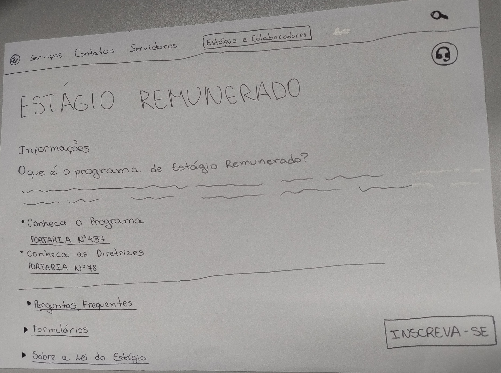
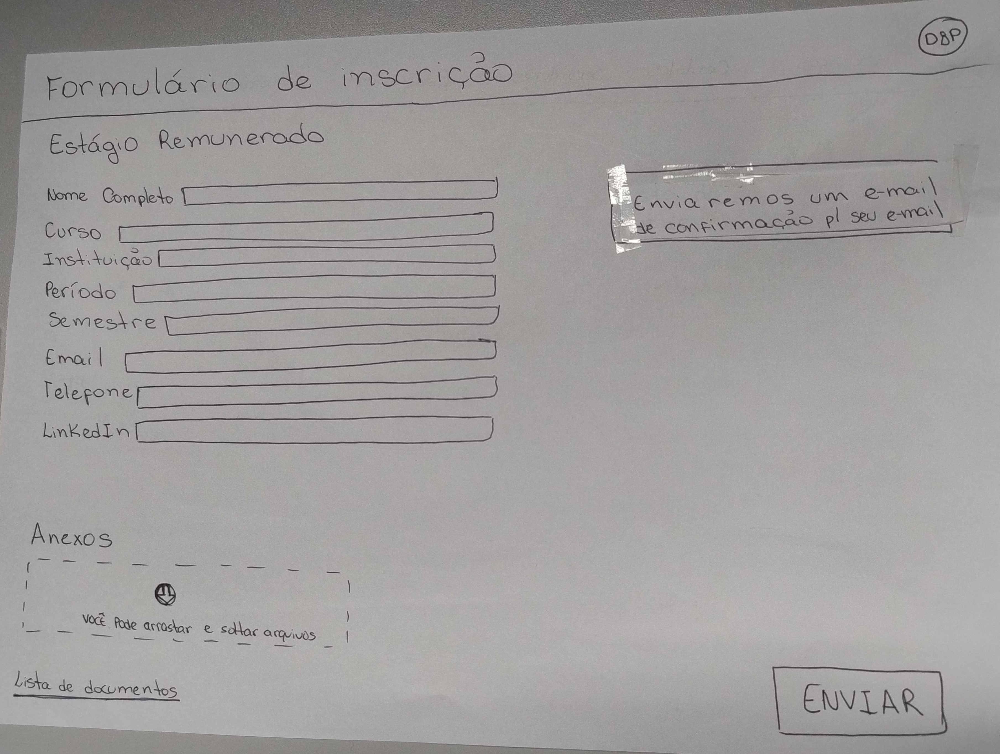
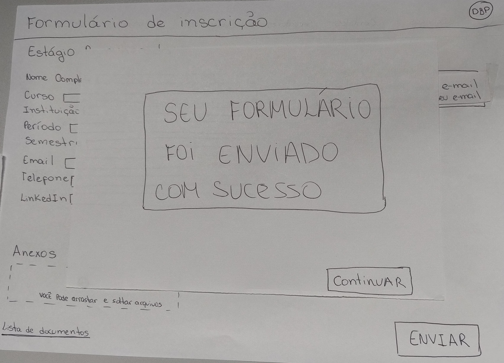

|    **Data**    | **Data Prevista de Revisão** | **Versão** |        **Descrição**        |                 **Autor**                 |                **Revisor**                 |
|:--------------:|:---------------------------:|:----------:|:---------------------------:|:-----------------------------------------:|:------------------------------------------:|
|  27/12/2024    |        03/01/2025          |    1.0     |     Criação do Documento     | [Karolina Vieira](https://github.com/Karolina91) |  [Paola Nascimento](https://github.com/paolaalim) |

# Resultado do Relato do Protótipo de Papel  

## Introdução  

Os protótipos têm como finalidade permitir que usuários e stakeholders interajam com uma visão inicial de um produto. Essa interação é extremamente útil para identificar pontos fortes e áreas de melhoria em funcionalidades e no produto como um todo.  

O uso de protótipos de papel prioriza a avaliação das funcionalidades, abstraindo questões relacionadas ao design. Dessa forma, reduz-se a chance de distrações por parte do usuário, possibilitando um foco maior na experiência prática.  

Entre os principais benefícios dos protótipos estão:  
- Estímulo à reflexão sobre o design;  
- Esclarecimento de requisitos;  
- Possibilidade de realizar testes iniciais.  

## Objetivos  

Esta avaliação busca compreender, no aplicativo e em fluxos alternativos, quais elementos estão bem implementados e quais precisam de ajustes. O resultado é uma lista de feedbacks obtidos de usuários reais.  

## Metodologias  

Para obter a maior quantidade possível de informações, o projeto de IHC Defensoria Publica optou por utilizar entrevistas como ferramenta para coletar pontos positivos e negativos do design. As entrevistas também possibilitam direcionar a simulação por meio de uma série de perguntas estruturadas.  

Antes de realizar as entrevistas, duas etapas fundamentais devem ser concluídas:  
1. **Elaboração do Protótipo de Papel**: Criar uma representação inicial do produto para facilitar a interação dos participantes.  
2. **Teste Piloto**: Realizar uma versão preliminar da entrevista, geralmente conduzida pelo grupo de desenvolvedores ou por uma pequena amostra de participantes.  

O teste piloto é essencial para identificar possíveis falhas no processo de avaliação e ajustar aspectos que possam comprometer a coleta de dados. Caso essa etapa seja ignorada, há um risco significativo de invalidar as informações obtidas durante a entrevista definitiva.  

## Prototipo de Papel

### Agendar uma consulta com o advogado 

### Figura 1 - Tela Inicial

<figcaption>Fonte: Karolina Vieira (2025)</figcaption>

### Figura 2 - Inserir Dados

<figcaption>Fonte: Karolina Vieira (2025)</figcaption>

### Figura 3 - Selecionar Tipo de Atendimento

<figcaption>Fonte: Karolina Vieira (2025)</figcaption>

### Figura 4 - Concluir Agendamento

<figcaption>Fonte: Karolina Vieira (2025)</figcaption>

### Registro da avaliação

No Video 1 e Tabela 1 é possível verificar os registros feitos durante a avaliação.
### Video 1: Gravação da avaliação

[Assista ao vídeo no YouTube](https://youtu.be/AADIGSBnepk)

#### Fonte:
[Karolina Vieira](https://github.com/Karolina91)

Tabela 1: Sumário de perguntas

| Pergunta                                                                                                      | Resposta |
| ------------------------------------------------------------------------------------------------------------- | :------: |
| Que parte da interface e da interação te deixa insatisfeito?|Nenhuma                           
| Você entende para que sereve cada elemento de interface?  | Sim|
| Há alternativas de desing mais efcientes? Mais fáceis de aprender? |Não|
| Os objetivos dos usuários podem ser alcançados facilmente através do sistema?|Sim
| O protótipo apresenta uma sêquencia de tarefas condizente com a realidade? |Sim|
| Você consegue operar o sistema?| Sim|

Fonte:
[ Karolina Vieira](https://github.com/Karolina91)

## Prototipo de Papel

### Inscrever-se no programa de estágio 

### Figura 1 - Tela Inicial

<figcaption>Fonte: Paola Nascimento (2025)</figcaption>

### Figura 2 - Tela de Inscrição para o Estágio

<figcaption>Fonte: Paola Nascimento (2025)</figcaption>

### Figura 3 - Formulário de Inscrição

<figcaption>Fonte: Paola Nascimento (2025)</figcaption>

### Figura 4 - Confirmação de Envio do Formulário

<figcaption>Fonte: Paola Nascimento (2025)</figcaption>

### Registro da avaliação

No Video 2 e Tabela 2 é possível verificar os registros feitos durante a avaliação.
### Video 2: Gravação da avaliação

[Assista ao vídeo no YouTube](https://youtu.be/0BaKN-wVO3Y)

#### Fonte:
[Paola Nascimento](https://github.com/paolaalim)

Tabela 2: Sumário de perguntas

| Pergunta                                                                                                      | Resposta |
| ------------------------------------------------------------------------------------------------------------- | :------: |
| Que parte da interface e da interação te deixa insatisfeito?|Nenhuma                           
| Você entende para que sereve cada elemento de interface?  | Sim|
| Há alternativas de desing mais efcientes? Mais fáceis de aprender? |Não|
| Os objetivos dos usuários podem ser alcançados facilmente através do sistema?|Sim
| O protótipo apresenta uma sêquencia de tarefas condizente com a realidade? |Sim|
| Você consegue operar o sistema?| Sim|

Fonte:
[Paola Nascimento](https://github.com/paolaalim)

## Análise da avaliação

A partir da análise dos relato dos resultados do protótipo de papel sobre e inscrever no estágio da DPDF, é possivel perceber que a entrevistada não apresentou dificuldades ao interagir com o protótipo, não tendo ocorrido erros ao longo do processo, nem sugestões de melhoraria de design ou modo de acessar operações. 

## Referências Bibliográficas
BARBOSA, Simone; DINIZ, Bruno. *Interação Humano-Computador*. Editora Elsevier, Rio de Janeiro, 2010.
