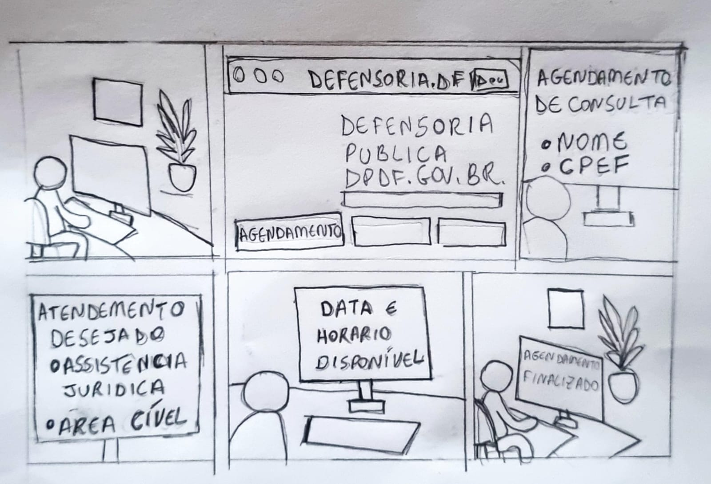

|    **Data**    | **Data Prevista de Revisão** | **Versão** |        **Descrição**        |                 **Autor**                 |                **Revisor**                 |
|:--------------:|:---------------------------:|:----------:|:---------------------------:|:-----------------------------------------:|:------------------------------------------:|
|  27/12/2024    |        03/01/2025          |    1.0     |     Criação do Documento     | [Karolina Vieira](https://github.com/Karolina91) |  [Paola Nascimento](https://github.com/paolaalim) |

# Introdução

O storyboard é um tipo de protótipo de baixa fidelidade amplamente valorizado por sua simplicidade, baixo custo e rapidez na criação. Sua flexibilidade permite modificações rápidas, tornando-o uma ferramenta prática e eficiente. Geralmente, é utilizado em conjunto com cenários ou roteiros, o que facilita a visualização e o planejamento de sequências de eventos, composição de cenas, movimentação de personagens, ângulos de câmera e outros elementos visuais essenciais. Essa prática ajuda a antecipar possíveis problemas narrativos, ajustar a fluidez da história e prever como ela será apresentada ao público.

O storyboard consiste em uma série de quadros sequenciais que ilustram os principais momentos, ações e aspectos visuais de uma cena ou de toda a narrativa. Cada quadro representa uma situação específica, acompanhada de descrições textuais ou diálogos pertinentes. No contexto de sistemas baseados em interfaces gráficas (GUI), esse tipo de artefato deve conter os seguintes aspectos:

- As pessoas envolvidas;
- O ambiente ou contexto em que a ação ocorre;
- As tarefas a serem realizadas;
- As etapas que compõem essas tarefas;
- A motivação para utilizar o sistema;
- As ações necessárias para a conclusão da tarefa;
- O grau de satisfação da pessoa ao concluir a atividade, refletido no encerramento do storyboard.

Esses protótipos foram desenvolvidos a partir das tarefas definidas nos cenários previamente elaborados.

## **Tarefa 1: Agendamento para uma consulta com um advogado (funcionalidade inexistente no site)**

Figura 1 apresenta um storyboard que ilustra o processo de um usuário acessando o site da Defensoria Pública do Distrito Federal para agendar uma consulta com um advogado.

**Figura 1** - Storyboard agendamento com advogado

<figcaption>Autor:
Karolina Vieira (2024)

 

## **Tarefa 5: Se inscrever no Programa de Estágio da DPDF (funcionalidade inexistente no site)**

Figura 2 apresenta um storyboard que ilustra o processo que um usuário faz ao acessar o site da Defensoria Pública do Distrito Federal para se inscrever no Estágio Remunerado da DPDF.

**Figura 2** - Storyboard sobre o processo para se inscrever no Programa 

<figcaption>Autor:Paola Nascimento (2025)

 

## Referências Bibliográficas
BARBOSA, Simone; DINIZ, Bruno. *Interação Humano-Computador*. Editora Elsevier, Rio de Janeiro, 2010.