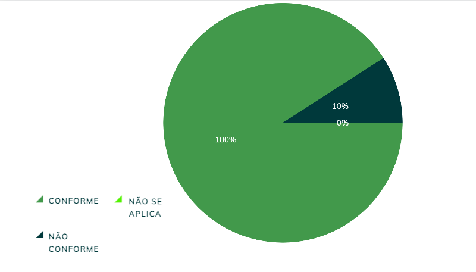

|    **Data**    | **Data Prevista de Revisão** | **Versão** |        **Descrição**        |                 **Autor**                 |                **Revisor**                 |
|:--------------:|:---------------------------:|:----------:|:---------------------------:|:-----------------------------------------:|:------------------------------------------:|
| 31/01/2025     |        31/01/2025           |    1.0     |     Criação do Documento     | [Karolina Vieira](https://github.com/Karolina91) |  [Paola Nascimento](https://github.com/paolaalim) |

# **Verificação Planejamento do Resultado e o Resultado de uma Avaliação**

## Tabela 01 - Verificação do Próprio Grupo

| ID  | Objetivo | Pergunta | Resposta | Versão |  
|-----|----------|----------|----------|--------|  
| 1   |  Material de apoio        | O material de apoio foi impresso antes da entrevista? |     Conforme     |    1.0    |  
| 2   |   teste-piloto       | No planejamento da avaliação foi realizado o teste-piloto? |  Conforme        |   1.0     |  
| 3   |   participantes       | Para recrutar participantes o perfil desejado foi avaliado? |   Conforme       |    1.0    |  
| 4   | Planejamento da avaliação | O planejamento da avaliação inclui a decisão de quando ela será realizada? |   Conforme       |   1.0     |  
| 5   | Relatório de avaliação | O relatório de avaliação inclui o método empregado, os participantes, dados coletados e problemas encontrados? |    Conforme      |  1.0      |  
| 6   | Consolidação de resultados | Os resultados individuais dos avaliadores e participantes são consolidados antes da análise? |    Conforme      |    1.0    |  

### Figura 1 -Proposta da Tela Incial da Defensoria Publica Distrito Federal 

## Tabela 02 - Verificação do Próprio Grupo +1 

 | ID  | Objetivo | Pergunta | Resposta | Versão |  
|-----|----------|----------|----------|--------|  
| 1   |  Material de apoio        | O material de apoio foi impresso antes da entrevista? |     Conforme     |    1.0    |  
| 2   |   teste-piloto       | No planejamento da avaliação foi realizado o teste-piloto? |  Conforme        |   1.0     |  
| 3   |   participantes       | Para recrutar participantes o perfil desejado foi avaliado? |   Conforme       |    1.0    |  
| 4   | Planejamento da avaliação | O planejamento da avaliação inclui a decisão de quando ela será realizada? |  Não Conforme       |   1.0     |  
| 5   | Relatório de avaliação | O relatório de avaliação inclui o método empregado, os participantes, dados coletados e problemas encontrados? |    Conforme      |  1.0      |  
| 6   | Consolidação de resultados | Os resultados individuais dos avaliadores e participantes são consolidados antes da análise? |    Conforme      |    1.0    |  

### Figura 1 -Proposta da Tela Incial da Defensoria Publica Distrito Federal 
