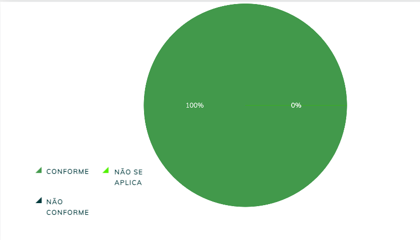
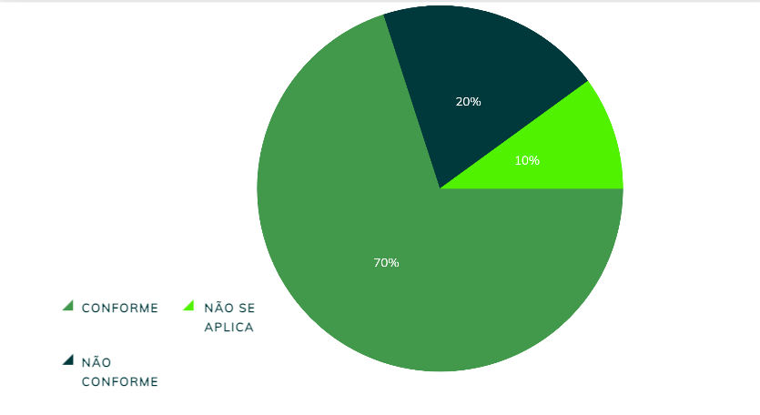

|    **Data**    | **Data Prevista de Revisão** | **Versão** |        **Descrição**        |                 **Autor**                 |                **Revisor**                 |
|:--------------:|:---------------------------:|:----------:|:---------------------------:|:-----------------------------------------:|:------------------------------------------:|
| 31/01/2025     |        31/01/2025           |    1.0     |     Criação do Documento     | [Karolina Vieira](https://github.com/Karolina91) |  [Paola Nascimento](https://github.com/paolaalim) |

# **Verificação Planejamento do Resultado e o Resultado de uma Avaliação**

## Tabela 01 - Verificação do Próprio Grupo

| ID  | Objetivo | Pergunta | Resposta | Versão | Data e Hora |
|-----|----------|----------|----------|--------|-------------|
| 1 | Planejamento da avaliação | O material de apoio foi impresso antes da entrevista?|     Conforme      | 1.0 | 03/02/2025, 21h |
| 2 | Planejamento da avaliação | No planejamento da avaliação foi realizado o teste-piloto?|     Conforme      | 1.0 | 03/02/2025, 21h |
| 3 | Planejamento da avaliação | Para recrutar participantes o perfil desejado foi avaliado? |     Conforme        | 1.0 | 03/02/2025, 21h |
| 4 | Planejamento da avaliação | O planejamento da avaliação inclui a decisão de quando ela será realizada?|       Conforme       | 1.0 | 03/02/2025, 21h |
| 5 | Relatório de avaliação   | O relatório de avaliação inclui o método empregado, os participantes, dados coletados e problemas encontrados? |       Conforme      | 1.0 | 03/02/2025, 21h |
| 6 | Consolidação de resultados | Os resultados individuais dos avaliadores e participantes são consolidados antes da análise?|       Conforme      | 1.0 | 03/02/2025, 21h |

### Figura 1 -Dados obtidos do grupo

## Tabela 02 - Verificação do Grupo +1

| ID  | Objetivo | Pergunta | Resposta | Versão | Data e Hora |
|-----|----------|----------|----------|--------|-------------|
| 1 | Planejamento da avaliação | O material de apoio foi impresso antes da entrevista?|     Não se aplica      | 1.0 | 03/02/2025, 21h |
| 2 | Planejamento da avaliação | No planejamento da avaliação foi realizado o teste-piloto?|     Não conforme      | 1.0 | 03/02/2025, 21h |
| 3 | Planejamento da avaliação | Para recrutar participantes o perfil desejado foi avaliado? |      Conforme      | 1.0 | 03/02/2025, 21h |
| 4 | Planejamento da avaliação | O planejamento da avaliação inclui a decisão de quando ela será realizada?|       Não conforme       | 1.0 | 03/02/2025, 21h |
| 5 | Relatório de avaliação   | O relatório de avaliação inclui o método empregado, os participantes, dados coletados e problemas encontrados? |      Conforme       | 1.0 | 03/02/2025, 21h |
| 6 | Consolidação de resultados | Os resultados individuais dos avaliadores e participantes são consolidados antes da análise?|      Conforme       | 1.0 | 03/02/2025, 21h |

### Figura 2 - Dados obtidos do grupo +1 

## Resultados

As figuras 1 e 2 Dados obtidos do grupo e do grupo +1, respectivamente, mostram os dados iniciais obtidos pelo grupo e pelo grupo +1 durante a análise de conformidade da verificação sobre Planejamento do Resultado e o Resultado de uma Avaliação. Nessas imagens, os itens são organizados e apresentados de acordo com sua situação, classificados em Conforme, Não Conforme e Não se Aplica. Essa estrutura visual permite que os membros do grupo acompanhem facilmente o status de cada item, facilitando o processo de verificação e identificação de eventuais discrepâncias ou conformidades, o que é essencial para garantir a precisão e qualidade da análise. 

## Referências Bibliográficas

[1] BARBOSA, Simone, et al. Interação Humano-Computador e Experiência do Usuário. Leanpub, p.303  cap 12, 2022.
