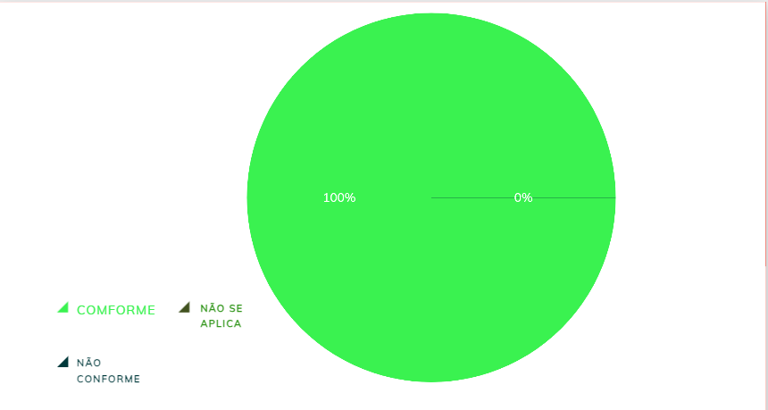
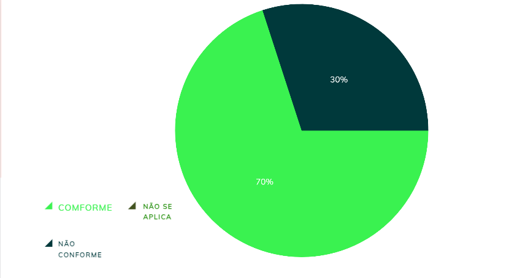

|    **Data**    | **Data Prevista de Revisão** | **Versão** |        **Descrição**        |                 **Autor**                 |                **Revisor**                 |
|:--------------:|:---------------------------:|:----------:|:---------------------------:|:-----------------------------------------:|:------------------------------------------:|
|  31/01/2025      |        31/01/2025           |    1.0     |     Criação do Documento     | [Karolina Vieira](https://github.com/Karolina91) |  [Paola Nascimento](https://github.com/paolaalim) |

# **Verificação do Elenco de Personas**

## Tabela 01 - Verificação do próprio grupo

| ID  | Objetivo | Pergunta | Resposta | Versão | Data e Hora |
|-----|----------|----------|----------|--------|-------------|
| 1   | Quantidade | O elenco de personas possui de 3 a 12 personas distintas? |conforme  | 1.0 | 03/02/2025, 20h|
| 2   | Unicidade | Cada persona tem características únicas e não se sobrepõe a outras? | conforme |   1.0 | 03/02/2025, 20h|
| 3   | Priorização | Cada elenco de personas inclui pelo menos uma persona primária? |conforme  |   1.0 | 03/02/2025, 20h|
| 4   | Alinhamento | As personas primárias estão alinhadas aos principais objetivos do projeto? |conforme  | 1.0 | 03/02/2025, 20h|
| 5   | Memorabilidade | As personas criadas são memoráveis e têm características que ajudam a diferenciá-las? |conforme  |  1.0 | 03/02/2025, 20h|
| 6   | Representatividade | O elenco de personas cobre os principais grupos de usuários do sistema? | conforme | 1.0 | 03/02/2025, 20h|
| 7   | Distribuição | Foi evitada a criação de muitas personas para um mesmo grupo de usuários? | conforme |  1.0 | 03/02/2025, 20h|
| 8   | Realismo | As personas criadas consideram uma perspectiva realista dos diferentes usuários? | conforme |  1.0 | 03/02/2025, 20h|
| 9   | Adequação | O número de personas criadas está adequado para o projeto (nem muito pequeno nem excessivo)? | conforme |  1.0 | 03/02/2025, 20h|
| 10  | Relevância | As personas primárias refletem os usuários mais relevantes para o desenvolvimento do produto? |conforme|  1.0 | 03/02/2025, 20h|

### Figura 2 - Dados obtidos do grupo

## Tabela 02 - Verificação do Grupo +1

| ID  | Objetivo | Pergunta | Resposta | Versão | Data e Hora |
|-----|----------|----------|----------|--------|-------------|
| 1   | Quantidade | O elenco de personas possui de 3 a 12 personas distintas? |conforme  | 1.0 | 03/02/2025, 20h|
| 2   | Unicidade | Cada persona tem características únicas e não se sobrepõe a outras? | conforme |   1.0 | 03/02/2025, 20h|
| 3   | Priorização | Cada elenco de personas inclui pelo menos uma persona primária? | Não conforme |   1.0 | 03/02/2025, 20h|
| 4   | Alinhamento | As personas primárias estão alinhadas aos principais objetivos do projeto? | Não conforme | 1.0 | 03/02/2025, 20h|
| 5   | Memorabilidade | As personas criadas são memoráveis e têm características que ajudam a diferenciá-las? | Conforme |  1.0 | 03/02/2025, 20h|
| 6   | Representatividade | O elenco de personas cobre os principais grupos de usuários do sistema? | Conforme | 1.0 | 03/02/2025, 20h|
| 7   | Distribuição | Foi evitada a criação de muitas personas para um mesmo grupo de usuários? | Conforme |  1.0 | 03/02/2025, 20h|
| 8   | Realismo | As personas criadas consideram uma perspectiva realista dos diferentes usuários? | Conforme |  1.0 | 03/02/2025, 20h|
| 9   | Adequação | O número de personas criadas está adequado para o projeto (nem muito pequeno nem excessivo)? |Conforme  |  1.0 | 03/02/2025, 20h|
| 10  | Relevância | As personas primárias refletem os usuários mais relevantes para o desenvolvimento do produto? | Não conforme |  1.0 | 03/02/2025, 20h|

### Figura 2 - Dados obtidos do grupo +1

## Resultados

As figuras 1 e 2 Dados obtidos do grupo e do grupo +1, respectivamente, mostram os dados iniciais obtidos pelo grupo e pelo grupo +1 durante a análise de conformidade da verificação sobre Elenco de Personas. Nessas imagens, os itens são organizados e apresentados de acordo com sua situação, classificados em Conforme, Não Conforme e Não se Aplica. Essa estrutura visual permite que os membros do grupo acompanhem facilmente o status de cada item, facilitando o processo de verificação e identificação de eventuais discrepâncias ou conformidades, o que é essencial para garantir a precisão e qualidade da análise. 

## Referências Bibliográficas

[1] BARBOSA, Simone, et al. Interação Humano-Computador e Experiência do Usuário. Leanpub, p.303  cap 12, 2022.