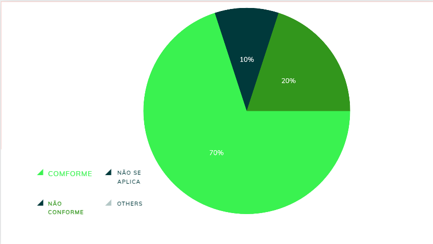

|    **Data**    | **Data Prevista de Revisão** | **Versão** |        **Descrição**        |                 **Autor**                 |                **Revisor**                 |
|:--------------:|:---------------------------:|:----------:|:---------------------------:|:-----------------------------------------:|:------------------------------------------:|
|  31/01/2025    |        31/01/2025          |    1.0     |     Criação do Documento     | [Karolina Vieira](https://github.com/Karolina91) |  [Paola Nascimento](https://github.com/paolaalim) |

# **Verificação da Análise Hierárquica de Tarefas - (HTA – Hierarchical Task Analysis)**

## Tabela 01 - Verificação do Grupo

| ID  | Objetivo | Pergunta | Resposta | Versão | Data e Hora |
|-----|----------|----------|----------|--------|-------------|
| 1   | Definição | A análise funcional de tarefas começa pela definição dos objetivos das personas? | Não Conforme  | 1.0 |03/02/2025, 19h |
| 2   | Hierarquia | A HTA examina principalmente os objetivos de alto nível? | Conforme | 1.0 |03/02/2025, 19h |
| 3   | Estruturação | Os planos definem os subobjetivos necessários para alcançar um objetivo maior? | Conforme | 1.0 |03/02/2025, 19h |
| 4   | Sequência | A ordem em que os subobjetivos devem ser alcançados é especificada no plano? | Conforme | 1.0 |03/02/2025, 19h |
| 5   | Relações | Os planos podem definir diferentes relações entre os subobjetivos (sequência fixa, seleção ou paralelo)? | Não se aplica | 1.0 |03/02/2025, 19h |
| 6   | Operações | Cada subobjetivo é alcançado por uma operação? | Conforme  |1.0   |03/02/2025, 19h|
| 7   | Ativação | A operação é especificada pelas circunstâncias nas quais o objetivo é ativado? | Conforme | 1.0 |03/02/2025, 19h |
| 8   | Instruções | As operações podem ser instruções diretas ou regras de feedback? | Conforme | 1.0 |03/02/2025, 19h |
| 9   | Condições | A operação inclui a especificação das condições sob as quais será desempenhada para cumprir um objetivo? | Conforme | 1.0 |03/02/2025, 19h |

### Figura 1 -Dados obtidos do grupo

## Tabela 02 - Verificação do Grupo +1 

| ID  | Objetivo | Pergunta | Resposta | Versão | Data e Hora |
|-----|----------|----------|----------|--------|-------------|
| 1   | Definição | A análise funcional de tarefas começa pela definição dos objetivos das personas? | Não conforme | 1.0 |03/02/2025, 19h10 |
| 2   | Hierarquia | A HTA examina principalmente os objetivos de alto nível? | Conforme | 1.0 |03/02/2025, 19h10 |
| 3   | Estruturação | Os planos definem os subobjetivos necessários para alcançar um objetivo maior? | Conforme | 1.0 |03/02/2025, 19h10 |
| 4   | Sequência | A ordem em que os subobjetivos devem ser alcançados é especificada no plano? | Conforme  | 1.0 |03/02/2025, 19h10 |
| 5   | Relações | Os planos podem definir diferentes relações entre os subobjetivos (sequência fixa, seleção ou paralelo)? | Conforme  | 1.0 |03/02/2025, 19h10 |
| 6   | Operações | Cada subobjetivo é alcançado por uma operação? | Conforme |1.0   |03/02/2025, 19h10|
| 7   | Ativação | A operação é especificada pelas circunstâncias nas quais o objetivo é ativado? |  Conforme | 1.0 |03/02/2025, 19h10 |
| 8   | Instruções | As operações podem ser instruções diretas ou regras de feedback? |Conforme  | 1.0 |03/02/2025, 19h10 |
| 9   | Condições | A operação inclui a especificação das condições sob as quais será desempenhada para cumprir um objetivo? | Conforme | 1.0 |03/02/2025, 19h10 |

### Figura 2 - Dados obtidos do grupo +1 

## Resultados

As figuras 1 e 2 Dados obtidos do grupo e do grupo +1, respectivamente, mostram os dados iniciais obtidos pelo grupo e pelo grupo +1 durante a análise de conformidade da verificação sobre  Análise Hierárquica de Tarefas - (HTA – Hierarchical Task Analysis). Nessas imagens, os itens são organizados e apresentados de acordo com sua situação, classificados em Conforme, Não Conforme e Não se Aplica. Essa estrutura visual permite que os membros do grupo acompanhem facilmente o status de cada item, facilitando o processo de verificação e identificação de eventuais discrepâncias ou conformidades, o que é essencial para garantir a precisão e qualidade da análise. 

## Referências Bibliográficas

[1] BARBOSA, Simone, et al. Interação Humano-Computador e Experiência do Usuário. Leanpub, p.303  cap 12, 2022.