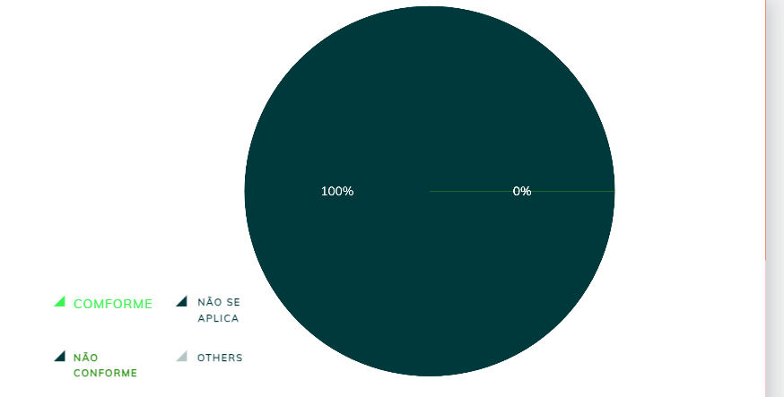

|    **Data**    | **Data Prevista de Revisão** | **Versão** |        **Descrição**        |                 **Autor**                 |                **Revisor**                 |
|:--------------:|:---------------------------:|:----------:|:---------------------------:|:-----------------------------------------:|:------------------------------------------:|
| 31/01/2025     |        31/01/2025           |    1.0     |     Criação do Documento     | [Karolina Vieira](https://github.com/Karolina91) |  [Paola Nascimento](https://github.com/paolaalim) |

# **Verificação Árvores de Tarefas Concorrentes (ConcurTaskTrees – CTT)**

## Tabela 01 - Verificação do Próprio Grupo

| ID  | Objetivo | Pergunta | Resposta | Versão |
|-----|----------|----------|----------|------|
| 1   | Iteratividade | As atividades do framework DECIDE são iterativas e interligadas? | Não se aplica | 1.0 |
| 2   | Adaptação | O avaliador pode precisar modificar os rumos da avaliação com base em novas descobertas? | Não se aplica | 1.0  |
| 3   | Objetivos | A determinação dos objetivos da avaliação é um passo essencial no framework DECIDE? | Não se aplica | 1.0  |
| 4   | Perguntas | O avaliador deve elaborar perguntas específicas para serem respondidas durante a avaliação? |Não se aplica  |1.0   |
| 5   | Métodos | A escolha dos métodos de avaliação deve considerar tanto fatores humanos quanto custos e experiência dos avaliadores? | Não se aplica |1.0   |
| 6   | Administração | A administração de questões práticas inclui o recrutamento de usuários para testes? |Não se aplica  |1.0   |
| 7   | Ética | A ética deve ser considerada no planejamento e execução da avaliação? | Não se aplica |1.0   |
| 8   | Interpretação | O avaliador deve interpretar os dados e compará-los com os objetivos da avaliação? |Não se aplica  |1.0   |

### Figura 1 -Proposta da Tela Incial da Defensoria Publica Distrito Federal 

## Tabela 02- Verificação do Grupo +1 

| ID  | Objetivo | Pergunta | Resposta | Versão |
|-----|----------|----------|----------|------|
| 1   | Iteratividade | As atividades do framework DECIDE são iterativas e interligadas? |  Não se aplica| 1.0 |
| 2   | Adaptação | O avaliador pode precisar modificar os rumos da avaliação com base em novas descobertas? | Não se aplica | 1.0  |
| 3   | Objetivos | A determinação dos objetivos da avaliação é um passo essencial no framework DECIDE? |Não se aplica  | 1.0  |
| 4   | Perguntas | O avaliador deve elaborar perguntas específicas para serem respondidas durante a avaliação? |Não se aplica  |1.0   |
| 5   | Métodos | A escolha dos métodos de avaliação deve considerar tanto fatores humanos quanto custos e experiência dos avaliadores? | Não se aplica |1.0   |
| 6   | Administração | A administração de questões práticas inclui o recrutamento de usuários para testes? |Não se aplica  |1.0   |
| 7   | Ética | A ética deve ser considerada no planejamento e execução da avaliação? |Não se aplica  |1.0   |
| 8   | Interpretação | O avaliador deve interpretar os dados e compará-los com os objetivos da avaliação? | Não se aplica |1.0   |

### Figura 2 - Dados obtidos do grupo +1

## Referências Bibliográficas

[1] BARBOSA, Simone, et al. Interação Humano-Computador e Experiência do Usuário. Leanpub, p.303  cap 12, 2022.