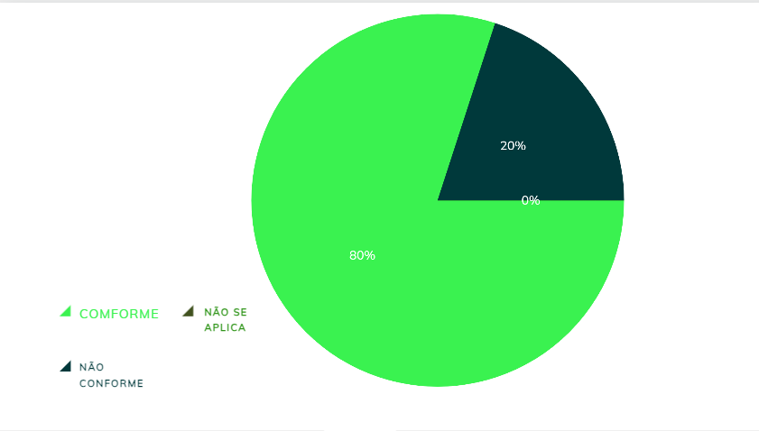

|    **Data**    | **Data Prevista de Revisão** | **Versão** |        **Descrição**        |                 **Autor**                 |                **Revisor**                 |
|:--------------:|:---------------------------:|:----------:|:---------------------------:|:-----------------------------------------:|:------------------------------------------:|
|  31/01/2025      |        31/01/2025           |    1.0     |     Criação do Documento     | [Karolina Vieira](https://github.com/Karolina91) |  [Paola Nascimento](https://github.com/paolaalim) |

# **Verificação Cenários**

## Tabela 01 - Verificação do próprio grupo

| ID  | Objetivo | Pergunta | Resposta | Versão | Data e Hora |
|-----|----------|----------|----------|--------|-------------|
| 1   | Comportamento | O cenário descreve o comportamento e as experiências dos atores? | Conforme | 1.0 | 03/02/2025, 19h50|
| 2   | Objetivos | Cada ator possui objetivos que dirigem as tarefas que ele realiza no tempo? | Conforme  | 1.0 | 03/02/2025, 19h50|
| 3   | Foco | O cenário apresenta um ator principal e um objetivo principal? | Não conforme |  1.0 | 03/02/2025, 19h50|
| 4   | Linha do Tempo | O cenário contém uma linha do tempo de descrições sobre o ambiente e as ações dos atores? | Conforme |  1.0 | 03/02/2025, 19h50|
| 5   | Interação | O cenário é focado na interação dos atores e como essas interações afetam a situação? | Não conforme |  1.0 | 03/02/2025, 19h50|
| 6   | Relevância | A descrição dos atores está limitada às suas características pessoais relevantes para a interação no cenário? |conforme  |  1.0 | 03/02/2025, 19h50|
| 7   | Clareza | Os cenários minimizam atributos irrelevantes dos atores para evitar distrações? | conforme |   1.0 | 03/02/2025, 19h50|

### Figura 1 - Dados Obtidos do grupo

## Tabela 02 - Verificação do grupo +1 

| ID  | Objetivo | Pergunta | Resposta | Versão | Data e Hora |
|-----|----------|----------|----------|--------|-------------|
| 1   | Comportamento | O cenário descreve o comportamento e as experiências dos atores? | Conforme | 1.0 | 03/02/2025, 19h50|
| 2   | Objetivos | Cada ator possui objetivos que dirigem as tarefas que ele realiza no tempo? | Conforme  | 1.0 | 03/02/2025, 19h50|
| 3   | Foco | O cenário apresenta um ator principal e um objetivo principal? | Não conforme |  1.0 | 03/02/2025, 19h50|
| 4   | Linha do Tempo | O cenário contém uma linha do tempo de descrições sobre o ambiente e as ações dos atores? | Conforme |  1.0 | 03/02/2025, 19h50|
| 5   | Interação | O cenário é focado na interação dos atores e como essas interações afetam a situação? | Não conforme |  1.0 | 03/02/2025, 19h50|
| 6   | Relevância | A descrição dos atores está limitada às suas características pessoais relevantes para a interação no cenário? |conforme  |  1.0 | 03/02/2025, 19h50|
| 7   | Clareza | Os cenários minimizam atributos irrelevantes dos atores para evitar distrações? | conforme |   1.0 | 03/02/2025, 19h50|

### Figura 1 - Dados Obtidos do grupo + 1

## Resultados

As figuras 1 e 2 Dados obtidos do grupo e do grupo +1, respectivamente, mostram os dados iniciais obtidos pelo grupo e pelo grupo +1 durante a análise de conformidade da verificação sobre Cenários. Nessas imagens, os itens são organizados e apresentados de acordo com sua situação, classificados em Conforme, Não Conforme e Não se Aplica. Essa estrutura visual permite que os membros do grupo acompanhem facilmente o status de cada item, facilitando o processo de verificação e identificação de eventuais discrepâncias ou conformidades, o que é essencial para garantir a precisão e qualidade da análise. 

## Referências Bibliográficas

[1] BARBOSA, Simone, et al. Interação Humano-Computador e Experiência do Usuário. Leanpub, p.303  cap 12, 2022.