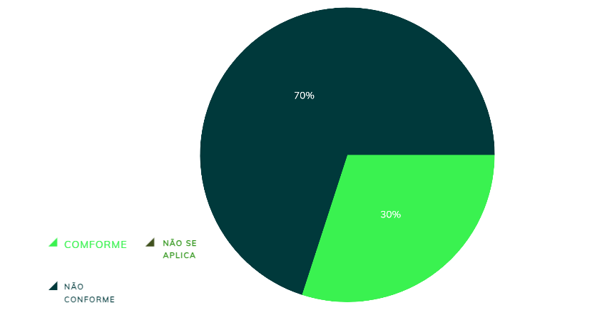

|    **Data**    | **Data Prevista de Revisão** | **Versão** |        **Descrição**        |                 **Autor**                 |                **Revisor**                 |
|:--------------:|:---------------------------:|:----------:|:---------------------------:|:-----------------------------------------:|:------------------------------------------:|
|  31/01/2025     |        31/01/2025           |    1.0     |     Criação do Documento     | [Karolina Vieira](https://github.com/Karolina91) |  [Paola Nascimento](https://github.com/paolaalim) |

# **Verificação Personas**

## Tabela 01 - Verificação do próprio grupo

| ID  | Objetivo | Pergunta | Resposta | Versão | Data e Hora |
|-----|----------|----------|----------|--------|-------------|
| 1   | Definir identidade | O nome e sobrenome da persona estão definidos? | Conforme | 1.0 | 03/02/2025, 20h40|
| 2   | Definir idade | A idade da persona foi especificada? | Conforme | 1.0 | 03/02/2025, 20h40|
| 3   | Representatividade | Os dados demográficos representativos do perfil da persona foram incluídos? | Não conforme | 1.0 | 03/02/2025, 20h40|
| 4   | Memorabilidade | Há uma foto ou imagem associada à persona para torná-la mais memorável? | Conforme | 1.0 | 03/02/2025, 20h40|
| 5   | Classificação | O status da persona foi definido (primária, secundária, stakeholder ou antagonista)? | Conforme |1.0 | 03/02/2025, 20h40|
| 6   | Antagonismo | A persona foi identificada como um antagonista ou alguém que não usará o sistema? | Conforme | 1.0 | 03/02/2025, 20h40|
| 7   | Objetivos | Os objetivos específicos da persona em relação ao produto ou sistema estão claros? | Conforme | 1.0 | 03/02/2025, 20h40|
| 8   | Alinhamento | Esses objetivos estão alinhados com as necessidades do projeto? | Conforme  | 1.0 | 03/02/2025, 20h40|
| 9   | Especialização | As especializações ou competências técnicas da persona foram descritas? | Conforme | 1.0 | 03/02/2025, 20h40|
| 10  | Experiência | O nível de instrução e experiência relevante foi definido? | Não conforme |  1.0 | 03/02/2025, 20h40|
| 11  | Tarefas | As tarefas principais que a persona realiza no contexto do sistema estão identificadas? | Conforme  |1.0 | 03/02/2025, 20h40|
| 12  | Processo | Há detalhes suficientes sobre como essas tarefas são realizadas? | Não conforme | 1.0 | 03/02/2025, 20h40|
| 13  | Relacionamentos | Os relacionamentos da persona com outros stakeholders foram considerados? | Conforme |1.0 | 03/02/2025, 20h40|
| 14  | Interações | As interações entre a persona e outros grupos ou indivíduos estão descritas? | Não conforme  |  1.0 | 03/02/2025, 20h40|
| 15  | Desafios | As dificuldades ou desafios enfrentados pela persona foram claramente identificados? | Conforme | 1.0 | 03/02/2025, 20h40|
| 16  | Solução | Há uma proposta de como o produto pode ajudar a superar essas barreiras? | Não conforme  |1.0 | 03/02/2025, 20h40|
| 17  | Expectativas | As expectativas da persona em relação ao produto estão descritas? |Não conforme  | 1.0 | 03/02/2025, 20h40|
| 18  | Sucesso | O que define sucesso para a persona ao usar o produto está claro? | Não conforme  | 1.0 | 03/02/2025, 20h40|

### Figura 1 - Dados obtidos do grupo

## Tabela 2- Verificação do Grupo+1 

| ID  | Objetivo | Pergunta | Resposta | Versão | Data e Hora |
|-----|----------|----------|----------|--------|-------------|
| 1   | Definir identidade | O nome e sobrenome da persona estão definidos? | Conforme | 1.0 | 03/02/2025, 20h50|
| 2   | Definir idade | A idade da persona foi especificada? | Conforme | 1.0 | 03/02/2025, 20h50|
| 3   | Representatividade | Os dados demográficos representativos do perfil da persona foram incluídos? | Não conforme | 1.0 | 03/02/2025, 20h50|
| 4   | Memorabilidade | Há uma foto ou imagem associada à persona para torná-la mais memorável? | Conforme | 1.0 | 03/02/2025, 20h50|
| 5   | Classificação | O status da persona foi definido (primária, secundária, stakeholder ou antagonista)? | Não Conforme |1.0 | 03/02/2025, 20h50|
| 6   | Antagonismo | A persona foi identificada como um antagonista ou alguém que não usará o sistema? | Não Conforme | 1.0 | 03/02/2025, 20h50|
| 7   | Objetivos | Os objetivos específicos da persona em relação ao produto ou sistema estão claros? | Conforme | 1.0 | 03/02/2025, 20h50|
| 8   | Alinhamento | Esses objetivos estão alinhados com as necessidades do projeto? | Conforme  | 1.0 | 03/02/2025, 20h50|
| 9   | Especialização | As especializações ou competências técnicas da persona foram descritas? | Não Conforme | 1.0 | 03/02/2025, 20h50|
| 10  | Experiência | O nível de instrução e experiência relevante foi definido? | Não conforme |  1.0 | 03/02/2025, 20h50|
| 11  | Tarefas | As tarefas principais que a persona realiza no contexto do sistema estão identificadas? | Conforme  |1.0 | 03/02/2025, 20h50|
| 12  | Processo | Há detalhes suficientes sobre como essas tarefas são realizadas? | Não conforme | 1.0 | 03/02/2025, 20h50|
| 13  | Relacionamentos | Os relacionamentos da persona com outros stakeholders foram considerados? | Não Conforme |1.0 | 03/02/2025, 20h50|
| 14  | Interações | As interações entre a persona e outros grupos ou indivíduos estão descritas? | Não conforme  |  1.0 | 03/02/2025, 20h50|
| 15  | Desafios | As dificuldades ou desafios enfrentados pela persona foram claramente identificados? | Conforme | 1.0 | 03/02/2025, 20h50|
| 16  | Solução | Há uma proposta de como o produto pode ajudar a superar essas barreiras? | Não conforme  |1.0 | 03/02/2025, 20h50|
| 17  | Expectativas | As expectativas da persona em relação ao produto estão descritas? |Não conforme  | 1.0 | 03/02/2025, 20h50|
| 18  | Sucesso | O que define sucesso para a persona ao usar o produto está claro? | Não conforme  | 1.0 | 03/02/2025, 20h50|

### Figura 2 - Dados obtidos do grupo +1 

## Resultados

As figuras 1 e 2 Dados obtidos do grupo e do grupo +1, respectivamente, mostram os dados iniciais obtidos pelo grupo e pelo grupo +1 durante a análise de conformidade da verificação sobre Personas. Nessas imagens, os itens são organizados e apresentados de acordo com sua situação, classificados em Conforme, Não Conforme e Não se Aplica. Essa estrutura visual permite que os membros do grupo acompanhem facilmente o status de cada item, facilitando o processo de verificação e identificação de eventuais discrepâncias ou conformidades, o que é essencial para garantir a precisão e qualidade da análise. 

## Referências Bibliográficas

[1] BARBOSA, Simone, et al. Interação Humano-Computador e Experiência do Usuário. Leanpub, p.303  cap 12, 2022.